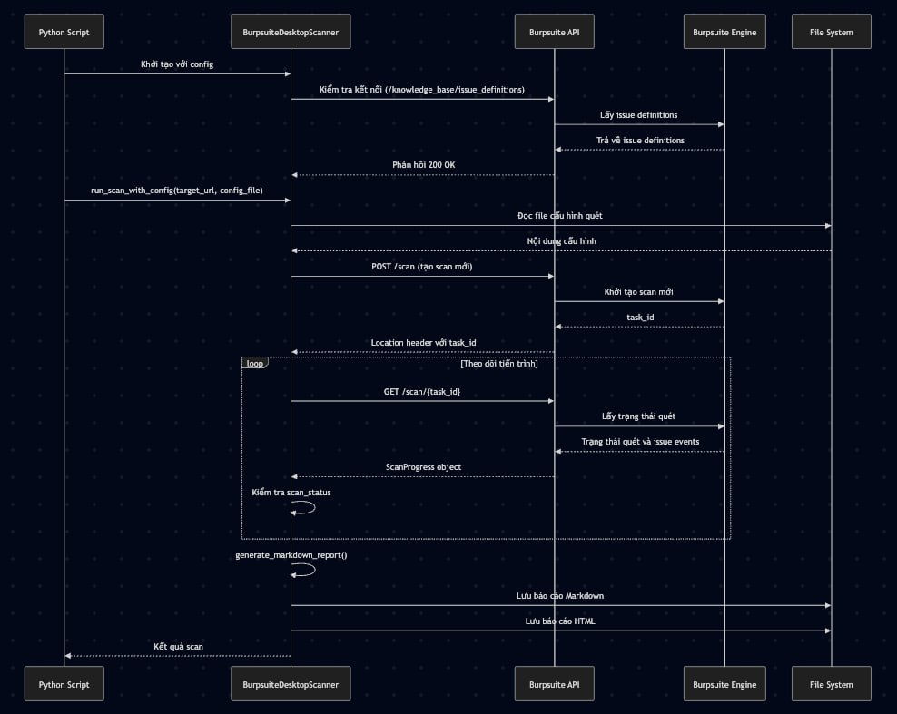
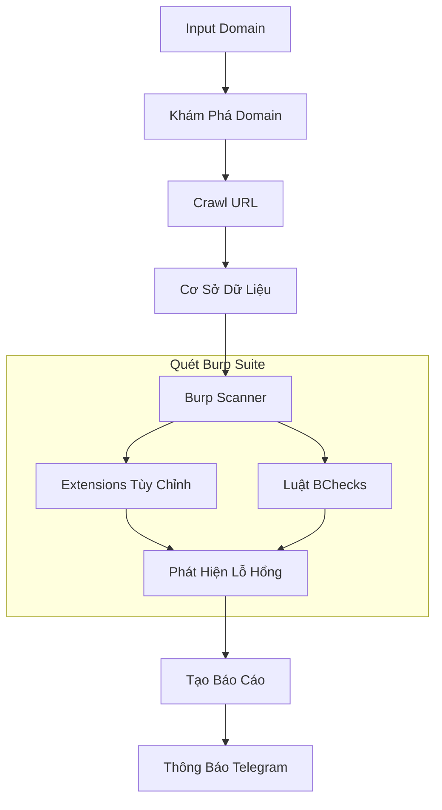
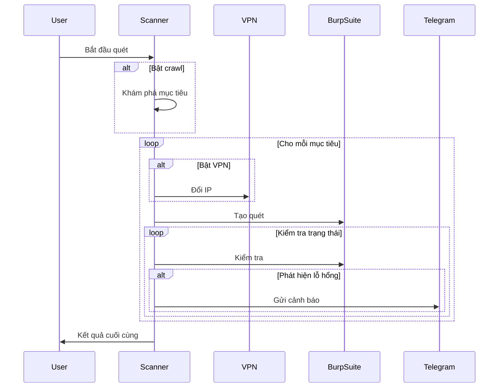

# Sharingan - Công Cụ Quét Bảo Mật Web Tự Động



## Tổng Quan

Sharingan là một công cụ quét bảo mật web tự động kết hợp nhiều công cụ trinh sát với khả năng quét của Burp Suite và cung cấp thông báo lỗ hổng qua Telegram.

## Sơ Đồ Kiến Trúc



## Quy Trình Hoạt Động



## Tính Năng

### 1. Khám Phá và Crawl Domain
- Tích hợp nhiều công cụ trinh sát:
  - **GAU**: Khám phá URL từ nhiều nguồn
  - **Katana**: Crawler thông minh với phân tích JavaScript
  - **Hakrawler**: Web crawler tốc độ cao
  - **Waybackurls**: Khám phá URL lịch sử
  - **Subjs**: Khám phá file JavaScript

### 2. Quét Lỗ Hổng
- Tích hợp Burp Suite REST API
- Cấu hình tùy chỉnh:
  - Extensions Burp Suite
  - Tích hợp BChecks
  - Profile quét tùy chỉnh

### 3. Tạo Báo Cáo
- Phân loại lỗ hổng theo mức độ nghiêm trọng
- Nhiều định dạng xuất:
  - Markdown (.md)
  - JSON

### 4. Hệ Thống Thông Báo
- Thông báo Telegram theo thời gian thực
- Chi tiết lỗ hổng

## Yêu Cầu Hệ Thống

- Burp Suite Professional với REST API
- Python 3.8+
- Các công cụ cần thiết:
```bash
go install github.com/lc/gau/v2/cmd/gau@latest
go install github.com/projectdiscovery/katana/cmd/katana@latest
go install github.com/hakluke/hakrawler@latest
go install github.com/tomnomnom/waybackurls@latest
```

## Cài Đặt

1. Tải mã nguồn:
```bash
git clone https://github.com/yourusername/Sharingan.git
cd Sharingan
```

2. Cài đặt thư viện Python:
```bash
pip install -r requirements.txt
```

3. Cấu hình môi trường:
```bash
cp .env.example .env
# Chỉnh sửa file .env với cấu hình của bạn
```

## Cách Sử Dụng

### Lệnh Cơ Bản
```bash
python main.py --target-urls example.com
```

### Các Tùy Chọn
```bash
python main.py --crawl --use-vpn --target-urls example.com --max-targets 10
```

### Tham Số
- `--crawl`: Bật tính năng crawl
- `--target-urls`: URL mục tiêu
- `--max-targets`: Số lượng mục tiêu tối đa
- `--use-vpn`: Bật luân chuyển VPN

## Cấu Hình

### Thiết Lập Burp Suite
1. Bật REST API trong Burp Suite
2. Cấu hình API endpoint
3. Thiết lập BChecks

### Thiết Lập Telegram Bot
1. Tạo bot qua BotFather
2. Cấu hình token trong .env
3. Thiết lập chat ID

## Ví Dụ Báo Cáo

### Markdown
```markdown
# Báo Cáo Quét
## Mức Độ Cao
- [CVE-2023-XXXX] SQL Injection
  - URL: https://example.com/vulnerable
  - Mô tả: ...
```

### JSON
```json
{
  "vulnerabilities": {
    "high": [...],
    "medium": [...],
    "low": [...],
    "info": [...]
  }
}
```

## Giấy Phép

MIT License

## Đóng Góp

1. Fork dự án
2. Tạo nhánh tính năng
3. Gửi pull request

## Tác Giả

- Tên của bạn (@yourusername)

## Cảm Ơn

- Team ProjectDiscovery
- PortSwigger (Burp Suite)
- Cộng đồng phát triển