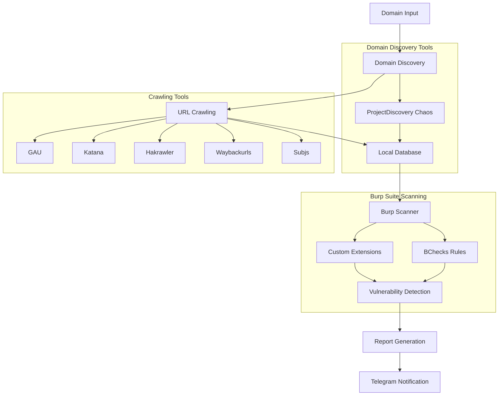

# Sharingan - Advanced Web Security Scanner

An automated web security scanning tool that combines multiple reconnaissance tools with Burp Suite's scanning capabilities and provides vulnerability notifications via Telegram.

## Overview

Sharingan automates the following workflow:
1. Domain Discovery & Crawling
2. Vulnerability Scanning
3. Report Generation
4. Notification System

## Architecture



## Features

### 1. Domain Discovery & Crawling
- Integration with multiple reconnaissance tools:
  - **GAU**: URL discovery from various sources
  - **Katana**: Smart crawler with JavaScript parsing
  - **Hakrawler**: Fast web crawler
  - **Waybackurls**: Historical URL discovery
  - **Subjs**: JavaScript file discovery
- Data storage in local database for persistence

### 2. Vulnerability Scanning
- Burp Suite REST API integration
- Custom configurations:
  - Burp Suite extensions
  - BChecks integration
  - Customized scanning profiles

### 3. Report Generation
- Vulnerability categorization by severity:
  - High
  - Medium
  - Low
  - Informative
- Multiple output formats:
  - Markdown (.md)
  - JSON

### 4. Notification System
- Real-time Telegram notifications
- Vulnerability details including:
  - Severity
  - URL
  - Description
  - Remediation steps

## Prerequisites

- Burp Suite Professional with REST API enabled
- Python 3.8+
- Required tools:
  ```bash
  go install github.com/lc/gau/v2/cmd/gau@latest
  go install github.com/projectdiscovery/katana/cmd/katana@latest
  go install github.com/hakluke/hakrawler@latest
  go install github.com/tomnomnom/waybackurls@latest
  ```

## Installation

1. Clone the repository:
```bash
git clone https://github.com/yourusername/Sharingan.git
cd Sharingan
```

2. Install Python dependencies:
```bash
pip install -r requirements.txt
```

3. Configure environment variables:
```bash
cp .env.example .env
# Edit .env with your configurations
```

## Usage

1. Basic scan:
```bash
python scanner.py -d example.com
```

2. Advanced scan with custom configuration:
```bash
python scanner.py -d example.com -c custom_config.json --format md
```

## Configuration

### Burp Suite Setup
1. Enable REST API in Burp Suite
2. Configure API endpoint (default: http://localhost:1337/v0.1)
3. Set up BChecks and required extensions

### Telegram Bot Setup
1. Create bot using BotFather
2. Configure bot token in .env file
3. Set up chat ID for notifications

## Output Examples

### Markdown Report
```markdown
# Scan Report
## High Severity
- [CVE-2023-XXXX] SQL Injection
  - URL: https://example.com/vulnerable
  - Description: ...
```

### JSON Report
```json
{
  "vulnerabilities": {
    "high": [...],
    "medium": [...],
    "low": [...],
    "info": [...]
  }
}
```

## License

MIT License

## Contributing

1. Fork the repository
2. Create your feature branch
3. Submit a pull request

## Authors

- Your Name (@yourusername)

## Acknowledgments

- ProjectDiscovery Team
- PortSwigger (Burp Suite)
- Contributors of all integrated tools